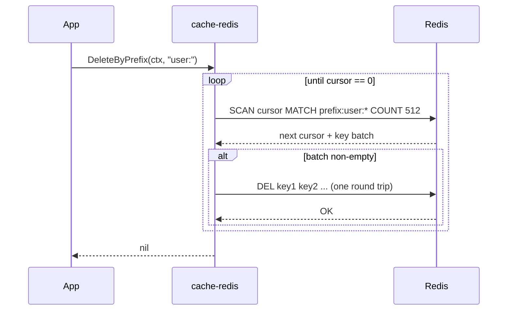

# ubgo/cache-redis — Redis cache adapter for Go


[](https://pkg.go.dev/github.com/ubgo/cache-redis) [](https://goreportcard.com/report/github.com/ubgo/cache-redis) [](https://github.com/ubgo/cache-redis/actions/workflows/test.yml) [](https://github.com/ubgo/cache-redis/actions/workflows/lint.yml)  [](https://github.com/ubgo/cache-redis/tags) [](./LICENSE) 


Redis 6+ cache adapter for Go, implementing the [`github.com/ubgo/cache`](https://github.com/ubgo/cache) contract on top of [`go-redis/v9`](https://github.com/redis/go-redis). It is a production-ready, drop-in Redis cache backend with native TTL, atomic counters, prefix isolation, `SCAN`-based bulk delete, and a Pub/Sub cross-process invalidation bus for tiered caches.

If you searched for "Go Redis cache library", "go-redis cache wrapper", "Redis cache adapter Golang", or "distributed cache invalidation Go" — this is the Redis backend of the `ubgo/cache` family.

> **Documentation:** a full per-feature cookbook with use cases and runnable snippets for every option, method, and the invalidation bus lives in [`docs/README.md`](docs/README.md).

## Why this adapter

- **Native Redis, no reinvention.** Every operation maps to the right Redis command: `SET EX/PX`, `SET NX`, `INCRBY`/`DECRBY`, `MGET`, pipelined multi-set. No client-side TTL bookkeeping.
- **Safe on huge keyspaces.** `DeleteByPrefix` and `Iterate` use cursor-based `SCAN` with batched `DEL` — never the blocking `KEYS` command — so they are safe to run against a multi-million-key production database.
- **Multi-tenant safe.** `WithPrefix` namespaces every key, and `Flush` is scoped to that prefix so two services can share one Redis database without stepping on each other.
- **Tiered-cache ready.** `NewInvalidation` ships a Redis Pub/Sub invalidation bus so an L1/L2 [`cache-tiered`](https://github.com/ubgo/cache-tiered) deployment can run a long L1 TTL and still stay coherent across pods.
- **Conformance-tested, Docker-free.** Passes the shared `cachetest.Run` suite fully in-process via `miniredis`. No Redis service required in CI.

## Features

| Capability | How it is implemented |
|---|---|
| Get / Set / Has | `GET` / `SET` / `EXISTS` |
| TTL introspection | `TTL`, with `-2`/`-1` mapped to `ErrNotFound` / no-expiry |
| Per-entry expiry | `SET EX`, `PEXPIRE` (millisecond precision for sub-second TTLs) |
| Atomic SetNX | `SET NX` |
| Atomic counters | `INCRBY` / `DECRBY` |
| Bulk get / set | `MGET` / pipelined `SET` |
| Delete by prefix | cursor `SCAN` + batched `DEL` (never `KEYS`) |
| Prefix-scoped flush | `SCAN`+`DEL` under the prefix, else `FLUSHDB` |
| Forward iteration | cursor `SCAN` |
| Cross-process invalidation | Redis Pub/Sub (`PUBLISH` / `SUBSCRIBE`) |

## Install

```sh
go get github.com/ubgo/cache-redis
```

Requires Go 1.24+ and Redis 6+ (works with `redis.Client`, `redis.ClusterClient`, and any `redis.UniversalClient`).

## Quick start

```go
package main

import (
	"context"
	"log"
	"time"

	"github.com/redis/go-redis/v9"
	rediscache "github.com/ubgo/cache-redis"
)

func main() {
	rdb := redis.NewClient(&redis.Options{Addr: "localhost:6379"})

	c := rediscache.New(rdb, rediscache.WithPrefix("svc:billing"))
	defer c.Close()

	ctx := context.Background()

	if err := c.Set(ctx, "invoice:42", []byte(`{"total":1999}`), time.Minute); err != nil {
		log.Fatal(err)
	}

	b, err := c.Get(ctx, "invoice:42") // (nil, cache.ErrNotFound) on miss
	if err != nil {
		log.Fatal(err)
	}
	log.Printf("%s", b)
}
```

## Constructor and options

### `New(rdb redis.UniversalClient, opts ...Option) *Cache`

Wraps any go-redis client. The adapter never closes the client you pass in — it only marks itself closed on `Close()` — so the same `*redis.Client` can be shared with other code.

```go
rdb := redis.NewClient(&redis.Options{Addr: "localhost:6379"})
c := rediscache.New(rdb)
```

Cluster works the same way:

```go
rdb := redis.NewClusterClient(&redis.ClusterOptions{Addrs: []string{":7000", ":7001"}})
c := rediscache.New(rdb)
```

### `WithPrefix(p string) Option`

Namespaces every key with `p`. A trailing `:` is appended if absent (`WithPrefix("svc:billing")` → keys become `svc:billing:<key>`). With a prefix set, `Flush` is **scoped to the prefix** (`SCAN`+`DEL` under `prefix:*`); without a prefix `Flush` falls back to `FLUSHDB`.

```go
billing := rediscache.New(rdb, rediscache.WithPrefix("svc:billing"))
search  := rediscache.New(rdb, rediscache.WithPrefix("svc:search"))

_ = billing.Set(ctx, "k", []byte("a"), time.Minute)
_ = search.Set(ctx, "k", []byte("b"), time.Minute)

_ = billing.Flush(ctx)            // wipes only svc:billing:*
ok, _ := search.Has(ctx, "k")     // still true — search is isolated
```

## Method reference

Every method below implements the `cache.Cache` contract. On miss or expiry, read methods return `cache.ErrNotFound` (never `nil, nil`). After `Close()`, every method returns `cache.ErrClosed`.

```go
ctx := context.Background()

// --- Reads ---
b, err := c.Get(ctx, "k")                       // GET; ErrNotFound on miss
m, err := c.GetMulti(ctx, []string{"a", "b"})   // MGET; missing keys absent from map
ok, err := c.Has(ctx, "k")                      // EXISTS
d, err := c.TTL(ctx, "k")                       // TTL; 0 = no expiry, ErrNotFound = no key

// --- Writes ---
err = c.Set(ctx, "k", []byte("v"), time.Minute) // SET EX (ttl<=0 => no expiry)
err = c.SetMulti(ctx, map[string]cache.Item{
	"a": {Value: []byte("1"), TTL: time.Minute},
	"b": {Value: []byte("2")},                  // no TTL
})                                              // pipelined SET
created, err := c.SetNX(ctx, "lock", []byte("1"), 30*time.Second) // SET NX

// --- Expiry ---
err = c.Expire(ctx, "k", 500*time.Millisecond)  // PEXPIRE (sub-second precise)
err = c.Expire(ctx, "k", 0)                      // PERSIST (remove TTL)
err = c.Touch(ctx, "k")                          // Expire(key, 1h)

// --- Counters ---
n, err := c.Incr(ctx, "hits", 1)                // INCRBY; missing key starts at 0
n, err = c.Decr(ctx, "hits", 2)                 // DECRBY

// --- Delete ---
err = c.Del(ctx, "a", "b")                      // DEL
err = c.DeleteByPrefix(ctx, "user:")            // SCAN + batched DEL (never KEYS)
err = c.Flush(ctx)                               // prefix-scoped or FLUSHDB

// --- Iterate ---
it := c.Iterate(ctx, cache.IterateOpts{Prefix: "user:", Count: 256})
defer it.Close()
for it.Next() {
	_ = it.Key()
	_ = it.Value()
}
if err := it.Err(); err != nil {
	log.Fatal(err)
}

// --- Lifecycle / stats ---
err = c.Ping(ctx)                                // PING
s := c.Stats()                                   // Entries = DBSIZE (best-effort)
err = c.Close()                                  // idempotent; does not close rdb
```

Notes that bite if ignored:

- `Expire` uses `PEXPIRE` (millisecond precision). Plain `EXPIRE` truncates any sub-second TTL up to a full second, silently breaking short-lived entries.
- `Expire(key, ttl<=0)` calls `PERSIST` (removes the TTL, keeps the value). It disambiguates "key missing" from "key already had no TTL" via `EXISTS` so a missing key correctly returns `ErrNotFound`.
- `Iterate` may skip a key that expired between the `SCAN` and the follow-up `GET`; this is expected and correct.
- `Stats().Entries` is `DBSIZE` — a database-wide count, not prefix-scoped.

## Cross-process invalidation (Redis Pub/Sub)

`NewInvalidation` builds a `cache.Invalidation` over Redis Pub/Sub. Wire it into [`cache-tiered`](https://github.com/ubgo/cache-tiered) so every pod drops its local L1 copy the instant any pod mutates a key — letting L1 run a long, fast TTL while staying coherent.

```go
inv := rediscache.NewInvalidation(rdb, "cache:invalidate")

tc := tieredcache.New(
	tieredcache.WithL1(memCache),               // nanosecond local hits
	tieredcache.WithL2(rediscache.New(rdb)),    // shared across pods
	tieredcache.WithInvalidation(inv),          // Pub/Sub coherence
)
defer tc.Close()
```

`Subscribe` blocks until the context is cancelled — run it in its own goroutine (`cache-tiered` does this for you). `Publish` sends one message per key. The special payload `cache.InvalidateAll` (published by tiered `Flush`/`DeleteByPrefix`) tells subscribers to drop their entire local view.

```mermaid
flowchart LR
    subgraph PodA["Pod A"]
        A1["L1 (mem)"]
        ATC["tiered.Del(\"k\")"]
    end
    subgraph PodB["Pod B"]
        B1["L1 (mem)"]
        BSub["Subscribe goroutine"]
    end
    subgraph PodC["Pod C"]
        C1["L1 (mem)"]
        CSub["Subscribe goroutine"]
    end
    ATC -->|"PUBLISH cache:invalidate k"| RPS(("Redis Pub/Sub channel"))
    RPS -->|"k"| BSub
    RPS -->|"k"| CSub
    BSub -->|"L1.Del(k)"| B1
    CSub -->|"L1.Del(k)"| C1
```

## How `DeleteByPrefix` and `Iterate` stay safe at scale

Both walk the keyspace with cursor-based `SCAN` (batch size 512 for delete, configurable via `IterateOpts.Count` for iteration). `KEYS` is never used — it blocks the Redis event loop on large databases. Deletes are issued per batch so memory stays bounded.



## FAQ

### How do I use Redis as a cache in Go?

Open a go-redis client, wrap it with `rediscache.New(rdb)`, and program against the `cache.Cache` interface. You get `Get`/`Set`/`SetNX`/`Incr`/TTL/iteration without writing Redis command strings.

### Does it support Redis Cluster and Sentinel?

Yes. `New` accepts any `redis.UniversalClient`, so `redis.NewClusterClient`, `redis.NewFailoverClient` (Sentinel), and `redis.NewClient` all work unchanged.

### Is `KEYS` ever used?

No. `DeleteByPrefix`, `Flush` (when prefixed), and `Iterate` use cursor-based `SCAN`. This is the single most important property for production safety.

### Can two services share one Redis database safely?

Yes — give each a distinct `WithPrefix`. Keys are namespaced and `Flush` is scoped to the prefix, so one service flushing cannot wipe another's data.

### How do I keep an in-process L1 cache coherent across pods?

Use `NewInvalidation` with `cache-tiered`'s `WithInvalidation`. Any mutation publishes to a Redis Pub/Sub channel; every pod's subscriber drops the affected L1 key.

### Why does sub-second TTL work here when plain `EXPIRE` would not?

`Expire` uses `PEXPIRE` (millisecond resolution). `EXPIRE` only accepts whole seconds and rounds sub-second TTLs up to 1s.

### Does `Close()` shut down my Redis client?

No. It only marks the adapter closed (idempotent). The `*redis.Client` you passed in is yours to manage — useful when it is shared with non-cache code.

### How is this tested without Docker?

The conformance suite runs against in-process `miniredis`, whose clock is fast-forwarded by a background ticker so wall-clock TTL tests actually expire. No Redis service, no Docker, in CI.

## Positioning vs other `ubgo/cache` adapters

| Adapter | Backing store | TTL introspection | Prefix ops | Cross-process invalidation | Best for |
|---|---|---|---|---|---|
| **cache-redis** (this) | Redis 6+ | Yes (`TTL`) | Yes (`SCAN`) | Yes (Pub/Sub) | Shared distributed cache, L2 tier |
| [cache-pg](https://github.com/ubgo/cache-pg) | Postgres / SQLite | Yes | Yes (`LIKE`) | No | Durable cache where you already run Postgres |
| [cache-tiered](https://github.com/ubgo/cache-tiered) | composes others | via tiers | via tiers | Yes (pluggable bus) | L1/L2 hot-path latency |
| [cache-memcached](https://github.com/ubgo/cache-memcached) | Memcached | No (unsupported) | No (unsupported) | No | Drop-in interop with an existing Memcached fleet |

## Contributing

See [CONTRIBUTING.md](./CONTRIBUTING.md) for the build/test/lint gate, the conformance contract, and the Docker-free `miniredis` test setup.
