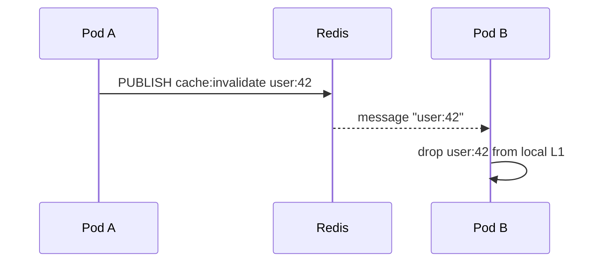

# Invalidation bus

`Invalidation` layers a Redis Pub/Sub bus on top so a tiered cache can keep
per-pod L1 copies coherent across processes. Delivery is **best-effort /
at-most-once**: a missed message only costs one stale L1 read until the L1 TTL
elapses.



### Invalidation

`type Invalidation struct { ... }`

What it is: a `cache.Invalidation` implementation backed by Redis Pub/Sub on a
single channel.

Use cases:

- Wire into [`cache-tiered`](https://github.com/ubgo/cache-tiered) via
  `WithInvalidation` so a long L1 TTL stays safe across pods.

```go
import (
	tieredcache "github.com/ubgo/cache-tiered"
	rediscache "github.com/ubgo/cache-redis"
)

inv := rediscache.NewInvalidation(rdb, "cache:invalidate")
t := tieredcache.New(
	tieredcache.WithL1(mem),
	tieredcache.WithL2(rediscache.New(rdb)),
	tieredcache.WithInvalidation(inv),
)
defer t.Close()
```

### NewInvalidation

`func NewInvalidation(rdb redis.UniversalClient, channel string) *Invalidation`

What it is: builds the bus on the given Pub/Sub `channel`.

Use cases:

- One channel per cache domain so unrelated invalidations do not cross-talk.

```go
inv := rediscache.NewInvalidation(rdb, "cache:invalidate:billing")
```

### Publish

`func (i *Invalidation) Publish(ctx context.Context, keys ...string) error`

What it is: `PUBLISH`es one message **per key** (not a batched payload) so a
subscriber can act on each key without parsing. Returns on the first `PUBLISH`
error; already-sent keys are not rolled back (best-effort by design). The
`cache.InvalidateAll` sentinel (empty string) is published like any other key
and interpreted by the consumer as "drop everything".

Use cases:

- Announce keys you just mutated so peers drop their stale L1 copies.
- Broadcast a full flush with `cache.InvalidateAll`.

```go
import "github.com/ubgo/cache"

_ = inv.Publish(ctx, "user:42", "user:43")
_ = inv.Publish(ctx, cache.InvalidateAll) // "" → peers drop everything
```

### Subscribe

`func (i *Invalidation) Subscribe(ctx context.Context, fn func(key string)) error`

What it is: blocks delivering each invalidated key to `fn` until `ctx` is
cancelled (returns `ctx.Err()`) or the channel closes unexpectedly (returns an
error). Always closes the subscription so the connection returns to the pool.
Pub/Sub is fire-and-forget: messages published while no subscriber is connected
are lost (acceptable — see top of page). Run in its own goroutine.

Use cases:

- The receive side of the coherence loop; `cache-tiered` runs this for you
  when you pass `WithInvalidation`.
- A standalone listener that drops keys from a local map.

```go
go func() {
	err := inv.Subscribe(ctx, func(key string) {
		if key == cache.InvalidateAll {
			localCache.FlushAll()
			return
		}
		localCache.Drop(key)
	})
	log.Println("subscribe ended:", err)
}()
```
